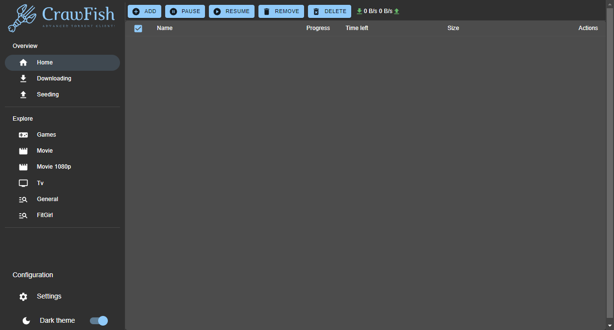
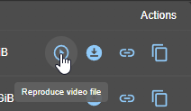
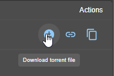
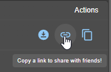
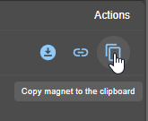
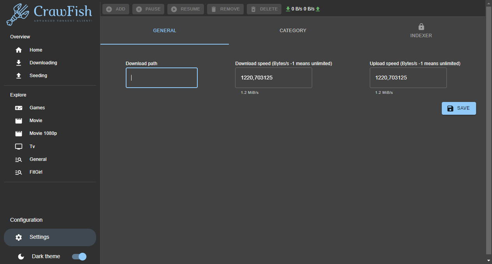
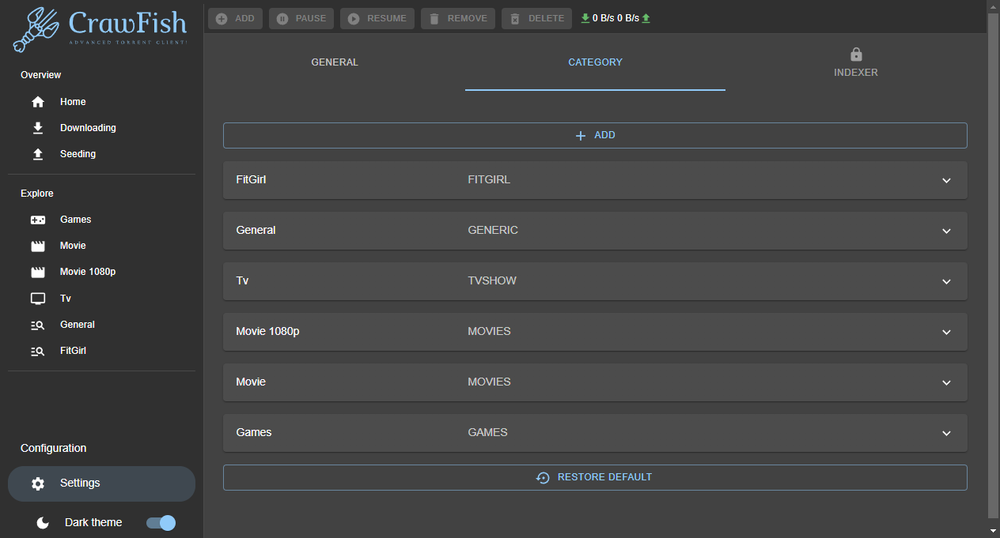
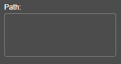
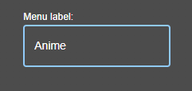
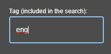

**Crawfish** is an innovative and free torrent client where anyone can stream/download torrents and share it with a simple link.

Available feature is:

- Basic torrent feature (Download/Seed)
- Torrent seeded by this client can be streamed or downloaded from webtorrent browser client like QPlayer.
  Example: [QPlayer with magnet](https://tndsite.gitlab.io/quix-player/?magnet=magnet:?xt=urn:btih:08ada5a7a6183aae1e09d831df6748d566095a10&dn=Sintel&tr=udp%3A%2F%2Fexplodie.org%3A6969&tr=udp%3A%2F%2Ftracker.coppersurfer.tk%3A6969&tr=udp%3A%2F%2Ftracker.empire-js.us%3A1337&tr=udp%3A%2F%2Ftracker.leechers-paradise.org%3A6969&tr=udp%3A%2F%2Ftracker.opentrackr.org%3A1337&tr=wss%3A%2F%2Ftracker.btorrent.xyz&tr=wss%3A%2F%2Ftracker.fastcast.nz&tr=wss%3A%2F%2Ftracker.openwebtorrent.com&ws=https%3A%2F%2Fwebtorrent.io%2Ftorrents%2F&xs=https%3A%2F%2Fwebtorrent.io%2Ftorrents%2Fsintel.torrent)
- Search torrent direct in the client [Based on **[Searx](https://searx.me/)** service fetch data from **nyaa**, **
  1337**, **rarbg**, **FitGirl** and more will be added in the future]
- Possibility to share a link to download file in the browser
- File can be opened even if the download is not finished yet

It uses **[WebTorrent-hybrid](https://github.com/webtorrent/webtorrent-hybrid)** - the first torrent client that works
in the browser. **WebTorrent** uses **[WebRTC](https://webrtc.org/)** for true peer-to-peer transport. No browser
plugin, extension, or installation is required.

### How to get CrawFish

Download the latest release here. [Download CrawFish](https://github.com/drakonkat/webtorrent-express-api/releases)

---

### How to use CrawFish

**CrawFish** is easy to use!

After you installed the client you are ready to Search and Download/Seed lot of content! But also there are some other
feature you can use in CrawFish

**Streaming**

When downloading a Movie or a TV Series, by clicking this icon, you will be able to watch it immediately in streaming!
It will be opened by your SO deafult video software (be careful that it can read all the video format).
Of course there is the limitation that you can't skip minutes of video if it is not already downloaded.

Here a little video that show how it work

**Get Torrent File**

While you are downloading a torrent, you are also able to download the torrent of the current file.

**Sharing is caring**

Yes, you can share what are you downloading with your friend, parents, enemies or whoever you want! By just clicking
that icon, in your clipboard will be copied
a link to send to your friend.

Then they just need to click the link and then they will start to download your same torrent via browser!*

\* The speed in accessing and downloading the file is proportional to how much seed the torrent has.

**Magnet Link**

By clicking this icon in your clipboard will be saved the magnet link of the current torrent.

### Exploring Settings

In the settings you will be able to perfomr different useful action!

**General Tab**

In this section you will be able set the path of the generic downloaded torrents

And also you will be able to set the speed of the Download and the Upload.

**Category Tab**

You want to add or remove a category from the **Explore** menu in base of your need? Wit CrawFish is possible! You have
just to follow some steps:

In the Settings there is the tab **Category** where you can add a label in the **Explore** menu in the main page as a
fast research section.

When you are in **Categroy** section, clic **Add** and will appear a Generic Category, then expand it by clicking on it.

Edit the fields by pressing the pencil icon or delete the created category by clicking the trashcan icon.

In the fields of the **Category** you have these possibilities:

- Choose a specific path where to dowload the torrents
- The name of the label that will appear in the Explore main menu
- You can include some tag for a faster research (ex. by writing "Eng" it will search for all the torrents that include
  the Eng language on the name)
- Have the possibility to put a default research for that
  category 

When everything is set, click on the save icon that appeared on the right instead of the pencil. Then in the Explore
menu you will have your custom category.

Here a GIF that resume the operations 

**Theme**

Also you are able to activate/disable the dark theme

### Note

> There is a way to support this project?

**Yes!** Simply use the software, open issue if there is improvement/bug fixing that can be done and say thanks! It is
enough

Issue can be send here. [Issue board](https://github.com/drakonkat/webtorrent-express-api/issues)

## License

MIT. Copyright (c) [Drakonkat](https://gitlab.com/tndsite/quix-player/-/blob/master/LICENSE).
